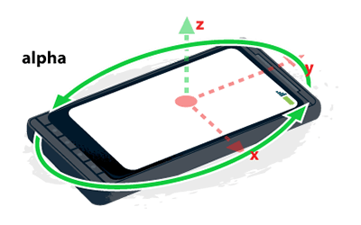
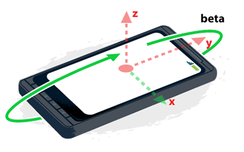
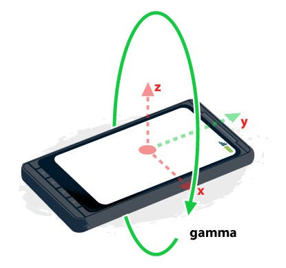

# HTML5 Device Orientation API

## Device Orientation

Device orientation in a mobile device is connected to the orientation of the device within 3D space. That means around the 3 axes. We are talking about how much the device is rotated around those 3 axes.

This is different than [Screen Orientation(./screen-orient.md), which is the portrait or landscape orientation of the screen.

Changes in the device orientation are reported through the deviceorientation event.

Best practice in your script is to test and make sure that this is available.

```js
if (window.DeviceOrientationEvent) {
  //we can add an event listener for deviceorientation to the window object.
}
```

The function which gets called by our deviceorientation event will return an Object that has three properties - alpha, beta, and gamma.

```js
function( orientation ){
  console.log( orientation.alpha );
  console.log( orientation.beta );
  console.log( orientation.gamma );
}
```

The three axes are:

  

The alpha angle is rotation around the z axis, which would be like you pushing your finger through the middle of the screen.

The beta angle is rotation around the x-axis, which is moving the top or bottom of the phone towards you or away from you while you are looking directly at the phone.

The gamma angle is rotation around the y-axis, which is a line down the middle of the phone from the top to the bottom (where you would typically plug in your charger).

Some devices will also return some sort of compassHeading property as well.

## Device Motion

The device motion properties measure changes in the position of the device along the three axes over time. There are four properties - acceleration, interval, accelerationIncludingGravity, and rotationRate.

It can be a lot more complex a task to calculation device motion because the device orientation will impact the information that you are getting.

If your phone is lying flat on a table and is picked straight up then you are talking about motion along its Z-axis.

If the phone is in someone's hand, held in front of their face, with the screen vertical, then we are talking about motion along it's y axis.

In both cases we are talking about movement away from the ground but the orientation of the device will change which axis reports the motion.

```js
if( window.DeviceMotionEvent ){
  window.addEventListener('devicemotion', function( motion ){
    console.log( motion.acceleration, motion.interval );
  }
}
```

## References and Resources

[Google Developer Reference for Device Orientation](https://developers.google.com/web/fundamentals/native-hardware/device-orientation/)

## Return

[Back to Week 10 Module Home](./README.md)
