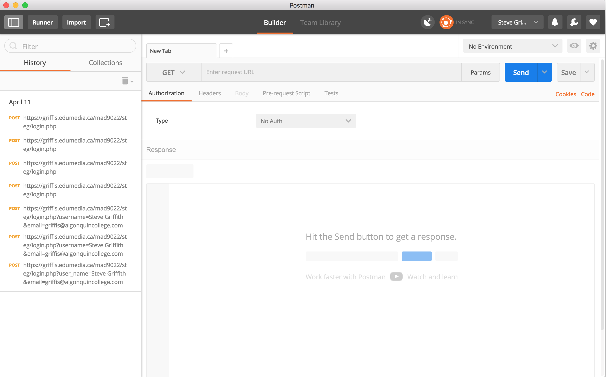

# Postman

Postman is a great tool for testing your APIs.

If you want to make calls to a server-side API and experiment with different parameters, then Postman is a easy way to do this.

## Install the Tool

You can either install Postman as a Chrome extension or as a standalone Native app.

[Download Postman](https://www.getpostman.com/).

## Using the Tool

With Postman open we will enter the details of the URL that we want to call.

In the center of the screen, near the top, you will see the word GET and an input field with the text "Enter request URL".

The method can be changed from GET to POST, PUT, HEAD, OPTIONS, DELETE, etc. For your final project, we are using POST.

The input field is where you would enter the URL that you want to call. (Your API endpoint).

Below the URL field, select the tab "Body" and then the option "form-data" or "x-www-form-urlencoded".

Then you can start entering any number of key and value pairs that will be sent to the web server at the URL listed above.

When you have entered all the parameters you want, then click the Save button.

In the screenshot above you can see, on the left, a list of the last URLs that I called with Postman. They are all URLs from the API for the final project.

<YouTube
    title="Postman Introduction"
    url="https://www.youtube.com/embed/t5n07Ybz7yI"
/>

<YouTube
    title="Postman Mock Servers"
    url="https://www.youtube.com/embed/pAD11I3k9q0"
/>

## References & Resources

[Postman Website](https://www.getpostman.com/)

[Official Documentation](https://www.getpostman.com/docs/)

[Sitepoint Tutorial](https://www.sitepoint.com/api-building-and-testing-made-easier-with-postman/)

[Tool for running batches of requests](http://blog.getpostman.com/2014/10/28/using-csv-and-json-files-in-the-postman-collection-runner/)

[Postman Mock Server tutorial](http://blog.getpostman.com/2016/01/26/using-a-mocking-service-to-create-postman-collections/)

[tool for creating mock end points](https://www.mockable.io/)

[tool for generating sample JSON data](http://www.json-generator.com/)

[Sample JSON files](https://www.sitepoint.com/10-example-json-files/)

[Mockaroo data generator for multiple formats](https://www.mockaroo.com/)

[fake online API generator](http://jsonplaceholder.typicode.com/)

## Return

[Back to Week 13 Module Home](./README.md)
